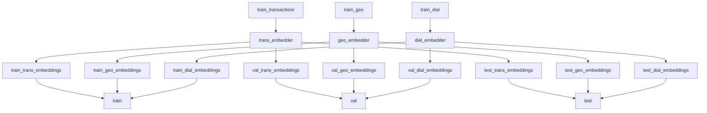

## Лидеры цифровой трансформации - 2024
# Предиктивная модель для рекомендации продуктов банка
## Команда `InsightAI`
[](https://pdm-project.org) [](https://github.com/psf/black)

# Описание
## Настройка окружения
PDM: Python package management tool
```
pdm install
```
Подробнее https://github.com/pdm-project/pdm
### Основные зависимости
- pytorch-lifestream
- py-boost

## Описание решения

`train` - эмбединги по клиентам на основе обучающей выборки на каждый месяц
`val` - эмбединги по клиентам на основе тестовой выборки на каждый месяц
`test` - эмбединги по клиентам на следующий месяц (2023-01-31), который заливается в лидерборд

### Тюнинг pytorch-lifestream
Из выборок берётся sample в 5% клиентов. На этом сэмпле 

### Обучение pytorch-lifestream

### Получение эмбедингов

### Обучение pyboost


## Структура репозитория
```
├── README.md
├── data               <- данные (в гит не загружены, очень большие)
├── models             <- используемые модели (для эмбедингов и для предикшена)
├── notebooks          <- Jupyter notebooks с примерами и исследованиями
├── pyproject.toml     <- Project configuration file
├── requirements.txt
└── src                     <- Source code
    ├── __init__.py
    └── lct_2024                
        ├── __init__.py 
        ├── predict.py          <-           
        └── train.py            <- 
```
